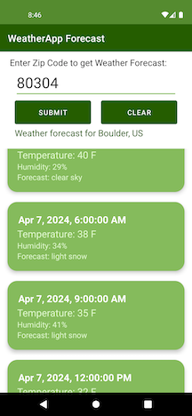

# WeatherApp

**WeatherApp+** is a clean & simple sample app that allows the user to input a zip code and 
then get a 5-day weather forecast for that zip code. This app was created to gain a better 
understanding of the data layer of Android app architecture including RESTful calls to 
multiple APIs and then storing the results in local storage.

## Discussion of Architecture, Frameworks, and UI
This project was created using MVVM architecture utilizing app, presentation(ui, ViewModel), 
and data modules that are tied together using Koin dependency injection. Local storage is handled
by the Room Framework and the data flow is structured to be unidirectional. 

The UI is simple: the user enters a zip code which is passed through the architecture to the 
RemoteDataSource, which uses that zipcode to get the zip code's geolocation. That geolocation is 
then used to make another call to get a Json payload of weather forecast information from OpenWeather's 
public API that is returned from one API call.

The payload is translated into various data classes (DTOs) that are stored locally in a Room Database. 
These Database entries initiate Kotlin Flows which are collected by the presentation layer UI. The 
app uses XML Views including a RecyclerView and Adapter to present the information to the user via
a scrolling list of cards, each representing a forecast for every 3 hours in the future for 5 days.
